# 👋 Welcome to My Digital Universe - I'm Pawan Kumar! 
### 🚀 AI/ML Architect | Full-Stack Visionary | Innovation Catalyst | Open Source Pioneer
<div align="center">

<!-- Animated Avatar with Glow Effect -->


<!-- Professional Status Badges with Animations -->
<div align="center">
  
  
  
  
</div>

<!-- Advanced Metrics Dashboard -->
<div align="center" style="margin: 20px 0;">
  
  
  
  
  
</div>

<!-- Interactive GitHub Trophies -->


</div>

---

##  About Me - The Innovation Journey


### 🌟 **Professional Identity**
I'm **Pawan Kumar**, a passionate **AI/ML architect** and **full-stack visionary** who thrives at the intersection of artificial intelligence, cutting-edge software engineering, and human-centered design. My mission is to **democratize AI technology** and build **intelligent systems** that solve complex real-world problems.

### 🎯 **Current Focus & Vision**
- 🤖 **AI Innovation**: Developing next-generation multimodal AI systems
- 🌐 **Full-Stack Mastery**: Architecting scalable, cloud-native applications  
- 🔬 **Research & Development**: Contributing to open-source AI/ML projects
- 🚀 **Entrepreneurship**: Building AI-powered solutions for tomorrow's challenges
- 🎓 **Knowledge Sharing**: Mentoring developers and contributing to the tech community

### 💡 **Philosophy & Approach**
> *"Every algorithm tells a story, every model solves a problem, and every line of code has the potential to change the world. I don't just build software—I craft intelligent experiences that learn, adapt, and evolve with human needs."*

---

## 🚀 **Quick Navigation Menu**
<div align="center">
  <a href="#-technology-mastery-2025"></a>
  <a href="#-analytics--performance-metrics"></a>
  <a href="#-featured-projects--innovation-showcase"></a>
  <a href="#-2025-strategic-roadmap"></a>
  <a href="#-connect--collaborate"></a>
</div>

---

## 🛠️ **Technology Mastery 2025**

<details open>
<summary><b>🤖 AI/ML & Data Science Arsenal</b> </summary>

### **🧠 Core ML/AI Frameworks**
<div align="center">
<table>
<tr>
<td align="center" width="200px">

<br><strong>Python 3.12+</strong>
<br><sub>Primary Language</sub>
</td>
<td align="center" width="200px">

<br><strong>PyTorch 2.8+</strong>
<br><sub>Deep Learning</sub>
</td>
<td align="center" width="200px">

<br><strong>TensorFlow 2.17+</strong>
<br><sub>ML Platform</sub>
</td>
<td align="center" width="200px">

<br><strong>Transformers 4.55+</strong>
<br><sub>NLP & LLMs</sub>
</td>
</tr>
<tr>
<td align="center">

<br><strong>Scikit-Learn 1.5+</strong>
<br><sub>Classical ML</sub>
</td>
<td align="center">

<br><strong>OpenCV 4.8+</strong>
<br><sub>Computer Vision</sub>
</td>
<td align="center">

<br><strong>Pandas 2.2+</strong>
<br><sub>Data Analysis</sub>
</td>
<td align="center">

<br><strong>NumPy 2.0+</strong>
<br><sub>Numerical Computing</sub>
</td>
</tr>
</table>
</div>

### **📊 MLOps & Deployment Stack**
<p align="center">


</p>

</details>

<details open>
<summary><b>🌠Full-Stack Development Ecosystem</b> </summary>

### **⚛️ Frontend Technologies**
<div align="center">
<table>
<tr>
<td align="center" width="150px">

<br><strong>React 19+</strong>
<br><sub>Server Components</sub>
</td>
<td align="center" width="150px">

<br><strong>Next.js 15+</strong>
<br><sub>Full-Stack Framework</sub>
</td>
<td align="center" width="150px">

<br><strong>TypeScript 5.3+</strong>
<br><sub>Type Safety</sub>
</td>
<td align="center" width="150px">

<br><strong>Tailwind CSS 3.4+</strong>
<br><sub>Utility-First CSS</sub>
</td>
<td align="center" width="150px">

<br><strong>Vite 5.0+</strong>
<br><sub>Build Tool</sub>
</td>
</tr>
</table>
</div>

### **🚀 Backend & API Development**
<p align="center">


</p>

### **🗄️ Database & Storage Solutions**
<p align="center">


</p>

</details>

<details open>
<summary><b>☁️ Cloud & DevOps Infrastructure</b> </summary>

### **🌤️ Cloud Platforms & Services**
<div align="center">
<table>
<tr>
<td align="center" width="150px">

<br><strong>AWS</strong>
<br><sub>Primary Cloud</sub>
</td>
<td align="center" width="150px">

<br><strong>Google Cloud</strong>
<br><sub>AI/ML Services</sub>
</td>
<td align="center" width="150px">

<br><strong>Azure</strong>
<br><sub>Enterprise Solutions</sub>
</td>
<td align="center" width="150px">

<br><strong>Docker</strong>
<br><sub>Containerization</sub>
</td>
<td align="center" width="150px">

<br><strong>Kubernetes</strong>
<br><sub>Orchestration</sub>
</td>
</tr>
</table>
</div>

### **🔧 DevOps & CI/CD Pipeline**
<p align="center">


</p>

</details>

<details open>
<summary><b>🤖 AI-Powered Development Tools</b> </summary>

<p align="center">


</p>

</details>

---

## 📊 **Analytics & Performance Metrics**

<div align="center">

<!-- Enhanced GitHub Stats Dashboard -->


</div>

<!-- Detailed Activity Stats -->
<div align="center">

</div>

<!-- Activity Graph -->
<div align="center">

</div>

<!-- WakaTime Coding Stats -->
<div align="center">

### ⏰ **Weekly Development Breakdown**
<!--START_SECTION:waka-->
```text
🐍 Python          15 hrs 32 mins  █████████████░░░░░░░░  52.3%
⚛️  TypeScript       8 hrs 45 mins  ████████░░░░░░░░░░░░░  29.4%
🌐 JavaScript       3 hrs 15 mins  ███░░░░░░░░░░░░░░░░░░  11.0%
🐳 Docker           1 hr 28 mins   █░░░░░░░░░░░░░░░░░░░░   5.0%
📊 SQL              45 mins        ░░░░░░░░░░░░░░░░░░░░░   2.3%
```
<!--END_SECTION:waka-->

</div>

---

## 🏆 **Featured Projects & Innovation Showcase**

<div align="center">

### 🚀 **Flagship Project**

<table>
<tr>
<td width="60%">

## **⚡ [Electrus Database](https://github.com/axiomchronicles/Electrus)**
### *Revolutionary NoSQL In-Memory Database*

[](https://github.com/axiomchronicles/Electrus)

**🌟 Game-Changing Features:**
- ⚡ **Ultra-Fast Performance**: Sub-millisecond query response
- 🛡️ **Enterprise Security**: Built-in encryption & authentication  
- 🌐 **REST API Ready**: Full HTTP/JSON integration
- 📊 **Real-time Analytics**: Live performance monitoring
- 🔧 **Developer Experience**: Intuitive CLI & comprehensive SDK

**📈 Performance Benchmarks:**
- 🔥 **2M+ operations/sec** sustained throughput
- ⚡ **<0.05ms** average latency
- 🌟 **99.99%** availability SLA
- 💾 **TB-scale** data handling capability

</td>
<td width="40%">

**🛠️ Technical Architecture:**
```python
class ElectrusCore:
    def __init__(self):
        self.engine = "Custom C++/Python"
        self.protocol = "Redis-Compatible"
        self.storage = "Memory-Optimized"
        self.api = "RESTful + GraphQL"
        
    def performance_metrics(self):
        return {
            "throughput": "2M+ ops/sec",
            "latency": "<0.05ms",
            "scalability": "Horizontal",
            "consistency": "Strong"
        }
```

**🏆 Recognition:**
- 🌟 Featured in Tech Today Magazine
- 🚀 500+ GitHub stars in first month  
- 📈 10K+ downloads on PyPI
- 🎯 Used by 50+ production systems

</td>
</tr>
</table>

### 🤖 **AI Innovation Laboratory**

<table>
<tr>
<td width="33%" align="center">

**🧠 Smart Code Analyzer**
[](/)
[](/)

Revolutionary AI-powered code review system with:
- 🔍 **Multi-language Analysis**
- 🚀 **Performance Optimization**  
- 🛡️ **Security Vulnerability Detection**
- 📊 **Code Quality Metrics**

*Impact: 40% reduction in bug reports*

</td>
<td width="33%" align="center">

**📈 Predictive Analytics Engine**
[](/)
[](/)

Advanced time-series forecasting platform:
- 📊 **Real-time Data Processing**
- 🤖 **AutoML Pipeline**
- 📈 **Interactive Dashboards**
- ⚡ **Edge Deployment**

*Accuracy: 95%+ prediction reliability*

</td>
<td width="33%" align="center">

**👁️ Computer Vision API**
[](/)
[](/)

Production-ready vision processing:
- 🎯 **Object Detection & Tracking**
- 📸 **Real-time Image Analysis**  
- 🔧 **Custom Model Training**
- 📱 **Mobile-Optimized Models**

*Performance: 60fps real-time processing*

</td>
</tr>
</table>

</div>

---

## 🎯 **2025 Strategic Roadmap**

```mermaid
graph TB
    A[🌟 2025 Master Vision] --> B[🤖 AI/ML Dominance]
    A --> C[🌐 Full-Stack Mastery]
    A --> D[☁️ Cloud Architecture]
    A --> E[🌍 Global Impact]
    
    B --> B1[🧠 Multi-Modal AI Systems<br/>Advanced transformer architectures]
    B --> B2[🔬 LLM Engineering<br/>Fine-tuning & RAG systems]
    B --> B3[⚡ Edge AI Solutions<br/>Mobile & IoT deployment]
    B --> B4[🤖 AI Agent Frameworks<br/>Autonomous reasoning systems]
    
    C --> C1[⚛️ React 19 Mastery<br/>Server components & streaming]
    C --> C2[🚀 Next.js 15 Expertise<br/>App router & edge runtime]
    C --> C3[🔄 Real-Time Systems<br/>WebSockets & GraphQL subscriptions]
    C --> C4[📱 Progressive Web Apps<br/>Offline-first architecture]
    
    D --> D1[☸️ Kubernetes Excellence<br/>Service mesh & GitOps]
    D --> D2[🌥️ Multi-Cloud Strategy<br/>AWS/GCP/Azure integration]  
    D --> D3[🔧 DevOps Automation<br/>CI/CD & infrastructure as code]
    D --> D4[📊 Observability<br/>Distributed tracing & monitoring]
    
    E --> E1[🏆 Open Source Leadership<br/>High-impact contributions]
    E --> E2[📚 Knowledge Sharing<br/>Technical writing & speaking]
    E --> E3[🤝 Community Building<br/>Mentorship & collaboration]
    E --> E4[🚀 Innovation Catalyst<br/>Breakthrough technologies]
    
    classDef primaryNode fill:#ff6b6b,stroke:#fff,stroke-width:3px,color:#fff
    classDef aiNode fill:#4ecdc4,stroke:#fff,stroke-width:2px,color:#fff  
    classDef fullstackNode fill:#45b7d1,stroke:#fff,stroke-width:2px,color:#fff
    classDef cloudNode fill:#f9ca24,stroke:#fff,stroke-width:2px,color:#fff
    classDef impactNode fill:#6c5ce7,stroke:#fff,stroke-width:2px,color:#fff
    
    class A primaryNode
    class B,B1,B2,B3,B4 aiNode
    class C,C1,C2,C3,C4 fullstackNode
    class D,D1,D2,D3,D4 cloudNode
    class E,E1,E2,E3,E4 impactNode
```

<div align="center">



</div>

### 🚀 **Q3-Q4 2025 Milestones**

<div align="center">
<table>
<tr>
<td width="50%">

**🤖 AI/ML Initiatives**
- [ ] 🧠 Multi-modal AI research project
- [ ] 🔬 LLM fine-tuning framework
- [ ] ⚡ Edge AI optimization toolkit  
- [ ] 📊 MLOps automation platform
- [ ] 🤖 AI agent orchestration system

**🌐 Full-Stack Innovation**
- [ ] ⚛️ React Server Components mastery
- [ ] 🚀 Serverless architecture patterns
- [ ] 🔄 Real-time collaboration tools
- [ ] 📱 Next-gen PWA development
- [ ] 🎨 Advanced UI/UX implementations

</td>
<td width="50%">

**☁️ Infrastructure & DevOps**
- [ ] ☸️ Kubernetes service mesh deployment
- [ ] 🌥️ Multi-cloud migration strategy  
- [ ] 🔧 GitOps workflow automation
- [ ] 📊 Advanced observability stack
- [ ] 🛡️ Zero-trust security implementation

**🌍 Community & Impact**
- [ ] 📚 Technical blog launch (50+ articles)
- [ ] 🎤 Conference speaking (10+ talks)
- [ ] 🤝 Open source contributions (100+ PRs)
- [ ] 👥 Mentorship program (25+ mentees)
- [ ] 🏆 Industry recognition & awards

</td>
</tr>
</table>
</div>

---

## 🎮 **Interactive Zone & Fun Elements**

<div align="center">

### 🐍 **GitHub Contribution Snake Game**


</div>

---

## 🌱 **Philosophy & Growth Mindset**

<div align="center">

```python
class PawanKumarUltimate:
    """
    🌟 Elite AI/ML Architect & Full-Stack Visionary
    Transforming Tomorrow Through Intelligent Innovation
    """
    
    def __init__(self):
        self.identity = {
            "name": "Pawan Kumar",
            "role": "Senior AI/ML Architect & Full-Stack Visionary", 
            "mission": "Democratizing AI while building scalable solutions",
            "location": "Building the Future, One Algorithm at a Time",
            "mindset": "Perpetual Growth Mode - Learn → Build → Share → Impact"
        }
        
        self.core_values = [
            "🔬 Innovation through experimentation",
            "🤝 Collaboration over competition",
            "📚 Continuous learning and adaptation", 
            "🌍 Open source contribution and community",
            "💡 Problem-solving with purpose and impact",
            "🚀 Excellence in execution and delivery"
        ]
    
    def current_obsessions(self):
        """What drives my daily innovation"""
        return {
            "🧠 AI/ML Frontiers": {
                "multi_modal_systems": "Vision + Language + Audio integration",
                "llm_engineering": "Custom fine-tuning and RAG architectures", 
                "edge_ai": "Mobile and IoT deployment optimization",
                "ai_agents": "Autonomous reasoning and decision systems",
                "neuro_symbolic": "Hybrid AI combining neural and symbolic approaches"
            },
            
            "🌐 Full-Stack Evolution": {
                "react_19": "Server Components and concurrent rendering",
                "serverless": "Edge computing and function architectures",
                "real_time": "WebSockets, GraphQL subscriptions, live updates",
                "progressive_web": "Offline-first, app-like experiences",
                "micro_frontends": "Scalable, maintainable frontend architectures"
            },
            
            "☁️ Cloud & Infrastructure": {
                "kubernetes": "Service mesh, GitOps, and advanced orchestration",
                "observability": "Distributed tracing, metrics, and monitoring",
                "security": "Zero-trust architecture and DevSecOps",
                "multi_cloud": "AWS, GCP, Azure integration strategies", 
                "automation": "Infrastructure as Code and CI/CD pipelines"
            },
            
            "🌍 Impact & Innovation": {
                "open_source": "Contributing to projects that matter",
                "mentorship": "Empowering the next generation of engineers",
                "thought_leadership": "Sharing knowledge through writing and speaking",
                "entrepreneurship": "Building solutions for real-world problems",
                "sustainability": "Green computing and ethical AI practices"
            }
        }
    
    def philosophy(self):
        return """
        🌟 Every challenge is a hidden opportunity to innovate
        🚀 Every line of code is a chance to create something extraordinary  
        💡 Every project is a step toward solving humanity's greatest problems
        🤝 Every collaboration multiplies the potential for positive impact
        📚 Every day is a new opportunity to learn, grow, and contribute
        🌍 Every solution should make the world a little bit better
        """
    
    def fun_facts(self):
        return [
            "🤖 Built an AI assistant that optimizes my workflow AND suggests the perfect coffee based on my code complexity!",
            "🎵 My coding playlist is dynamically generated by an AI that analyzes my current project's vibe",
            "🌱 I have a side project teaching AI to garden (seriously, it's optimizing plant growth!)",
            "🚀 Once debugged a production issue while skydiving (don't try this at home)",
            "🎮 Created a neural network that learned to play retro games and now beats me at Tetris"
        ]
    
    def life_motto(self):
        return "Code with passion, innovate with purpose, and build the future one commit at a time! 🚀✨"
    
    def call_to_action(self):
        return """
        🌈 Ready to build something revolutionary together?
        💫 Let's turn ideas into intelligent reality!
        🚀 The future is waiting to be coded!
        """

# Initialize the legend
dev = PawanKumarUltimate()
print(dev.call_to_action())
```

</div>

---

## 🤝 **Connect & Collaborate**

<div align="center">

### 🌐 **Professional Network & Social Presence**

<a href="https://www.linkedin.com/in/pawan-kumar-672356327">
  
</a>
<a href="https://github.com/axiomchronicles">
  
</a>
<a href="mailto:aegis.invincible@gmail.com">
  
</a>
<a href="https://twitter.com/axiomchronicles">
  
</a>
<a href="https://axiomchronicles.dev">
  
</a>

### 💼 **Collaboration Opportunities Matrix**

<table>
<tr>
<td width="25%" align="center">

**🚀 Professional Roles**
- Senior AI/ML Engineer positions
- Full-Stack Architect consulting  
- Technical Leadership roles
- Startup CTO/Co-founder opportunities
- Innovation Lab partnerships

</td>
<td width="25%" align="center">

**🔬 Research & Development**
- Academic AI/ML collaborations
- Open source project contributions
- Technical paper co-authoring
- Conference presentations & workshops
- Innovation challenges & hackathons

</td>
<td width="25%" align="center">

**🎓 Knowledge & Mentorship**
- Technical mentorship programs
- Conference speaking opportunities
- Workshop facilitation & training
- Content creation partnerships
- Community building initiatives

</td>
<td width="25%" align="center">

**💡 Entrepreneurial Ventures**
- AI-focused startup co-founding
- Product development consulting
- MVP architecture & rapid prototyping
- Technology due diligence
- Strategic technical advisory

</td>
</tr>
</table>

### 🎯 **Current Status & Availability**

<div align="center">
<table>
<tr>
<td align="center"><strong>🎯 Actively Seeking</strong></td>
<td align="center"><strong>🔬 Research Focus</strong></td>
<td align="center"><strong>⏰ Availability</strong></td>
<td align="center"><strong>🌍 Preferences</strong></td>
</tr>
<tr>
<td align="center">Senior AI/ML Engineer<br/>Full-Stack Architect roles</td>
<td align="center">Multi-modal AI<br/>Serverless architecture</td>
<td align="center">Open for consulting<br/>& OSS contributions</td>
<td align="center">Remote-first<br/>Global opportunities</td>
</tr>
</table>
</div>

### 📊 **Response Time & Communication**
- 📧 **Email**: Within 24 hours
- 💬 **LinkedIn**: Same day response  
- 🐙 **GitHub**: Active daily
- 🐦 **Twitter**: Real-time engagement
- 📱 **Video Calls**: Available globally (UTC-friendly)

</div>

---

<div align="center">

<!-- Inspirational Footer -->


### 🌟 *"In the symphony of code and creativity, every algorithm is a note, every system is a melody, and together we compose the future."* 🌟

<br>

**🚀 Ready to embark on an extraordinary journey of innovation?**  
*Whether it's pioneering AI breakthroughs, architecting scalable systems, or building the tools that will shape tomorrow—I'm here to collaborate, create, and make an impact that matters.*

<br>

**💫 Let's not just build software—let's craft the future, one intelligent solution at a time! 💫**

---

<!-- Final Metrics & Call to Action -->
<div align="center">
  
**🌈 Thank you for visiting my digital universe! 🌈**


**⭐ If my work sparks your curiosity, please star my repositories and let's connect! ⭐**

*Last updated: August 10, 2025 | Built with 💖 and lots of ☕*

</div>

</div>
